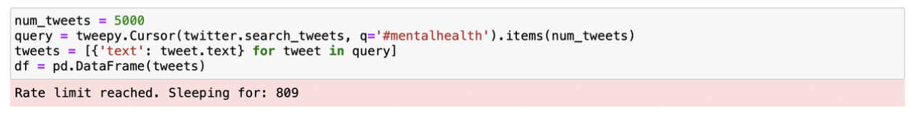
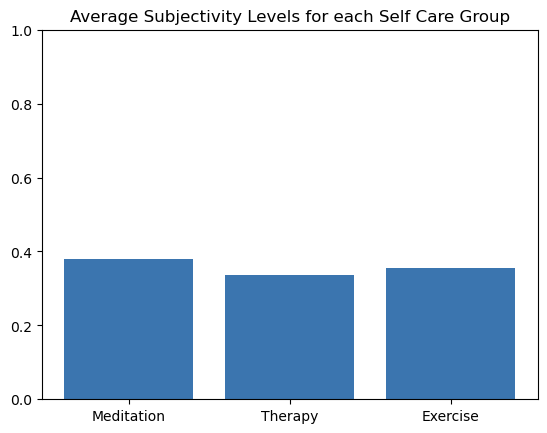
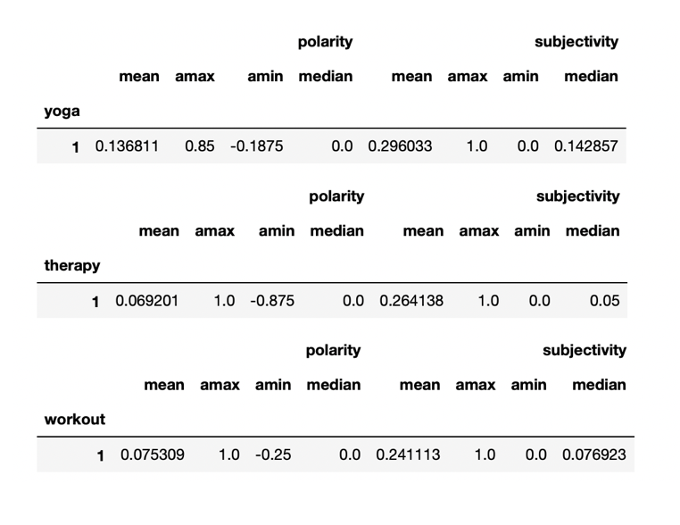
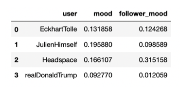

# Mental Health Twitter Analysis

## CIS 563 - Final Project Report

## Joseph Zoll and Prarthana Poojara

## Introduction

In this world of pursuit, business, politics, education, social dynamics, relationships,
romance, and a myriad of other areas, life has so many flavors to offer. This is a
blessing and a curse, as often we find ourselves diving so deep into developing rich
success in our lives that we forget to take care of the one of our most powerful assets
— **our minds.** Because of this, the past few decades have seen a rise in interest in
meditation, the process of developing concentration & awareness via many possible
practices. Meditation is practiced in secular and non-secular environments.
This rise become more prominient in the West, with apps like _Headspace_ and _Calm_
offering beginner introductions to those interesting in practicing meditation.
Furthermore, today and in many time periods we have seen spiritual teachers with large
followings have a great influence on those, speaking about things such as meditation.
The general theme has seemed to be improving one’s mental health, physical health,
self-esteem, and overall happiness. In this project, we set out to perform an experiment,
with our guiding questions being as follows:
→ **What helps our mental health the most?** Is it meditation? Yoga? Exercise?
→ **Who helps our mental health the most?** Do mental health advocates, spiritual
teachers, psychology professors, and in general “positive” mental health influencers
have a greater affect on their audiences than other types of influencers?

## Gathering & Preprocessing Data

For this project, our main hub for data came from the _Twitter API_. Twitter is one of, if not
_the_ , most prominent social media platform in the world. It is based in discussion, making
statements, observations, and commentary. You can find millions to possibly even
billions of tweets on mental health, meditation, and more.

#### Q 1 -> What helps our mental health the most? Is it meditation? Yoga? Exercise?

#### Q 2 -> Who helps our mental health the most? Do mental health advocates, spiritual teachers, psychology professors, and in general “positive” mental health influencers have a greater affect on their audiences than other types of influencers?

To communicate with the Twitter API, we used the _tweepy_ library in _Python_. Tweepy
allows us to do many things, such as:
Fetch users, user metadata, & user timeline tweets
Fetch tweets with a particular hashtag
For Section 1, we gathered 5,000 tweets containing the hashtag _#mentalhealth_. This
took a few minutes to load, but we managed to gather all the tweets needed for our
analysis.



For Section 2, we manually researched 50 “spirituality” accounts and 50 accounts of
famous actors, giving us 100 total accounts. These were all stored on a .csv file that
stored the searchable username for the Twitter API to retrieve.

## SECTION 1: Self Care Methodologies |

## Comparative Analysis

To answer , we set out to compare subgroups _within_ the mental health space. We
wanted to compare subgroups with huge followings by themselves. Namely we chose:
Meditation / Yoga
Therapy
Exercise
Our basis of comparing groups was **Sentiment Analysis**. Sentiment Anlaysis is the
process of analyzing the “mood” or “tone” of a piece of text. Sentiment analysis is used
in areas such as product review analysis, market research, and of course: Tweets on
Twitter.
In Python, there is a popular natural language processing library known as **NLTK**.
Within this library, can input a piece of text and output two important features:
Polarity (How positive or negative is this text?)
Subjectivity (How subjective/relative or objective is this text?)

#### Q 1

Polarity & subjectivity were our two targets in our sentiment analysis because of how
closely they intertwine with someone’s mood. We hypothesize: **Those with good
mental health score high in polarity and low in subjectivity (higher mood and are
more objective about their words)**
We performed a statistical analysis of the sentiments between 3 groups with 50-
tweets per group. That is:

### SECTION 1: Results

We extracted these groups via gathering 5000 tweets containing the hashtag:
**_#mentalhealth_** as an umbrella and each of the 3 groups being tweets that contain the
group titles themselves or synonyms (i.e. Meditation ,meditate, yoga, breathwork,
mindfulness, mindful, etc.).
Our results from that statistical analysis shows interesting findings, such as:

1. Meditation scores the highest in _both_ **Subjectivity** & **Polarity**.
2. Therapy sees the most objectivity on Twitter
3. Exercise sees the lowest mood/ **polarity** among the three groups

### 💬 NOTE: These polarity & subjectivity levels are that we evaluated using Sentiment Analysis average among the tweets^

### Graphical Comparisons between Self Care Groups




### Statistical Aggregation (yoga = Meditation Group)



## SECTION 2: Mental Health Groups Vs.

## Actors | K-Means Clustering

In this section, we were looking to gather tweets among many spiritual teachers,
psychology/psychology-related academics (professors), leaders, authors and more.
We also gathered tweets from a specific outgroup and our **hypothesis was: Spritiual
influencers have a more positive effect on their tweets and followers than other
outgroups**. The difference in this section is that we want to look at the sentiment
analysis of _the accounts themselves AND the sentiment analysis of the followers of
these accounts_. We want to see if positive accounts foster positive sentiments among
themselves and the people they have an impact on.
We chose **Actors** (movies, TV) as our chosen outgroup for comparison.

#### Clustering Process

As mentioned in the preprocessing section, we researched every Twitter account,
getting 50 spiritual accounts and 50 actor accounts. From here, we had a big task we
attempted:

```
1. Gather 50-100 timeline tweets per accounts (10,000 tweets) → Account Mood
2. For every 10 followers per accounts, gather 10 tweets each (10,000 tweets)→
Follower Mood
3. Once we have every Account Mood & Follower Mood (again an average), we will
have everything neatly placed in a Pandas Dataframe. A small version may look like
this:
```



```
6. Scatter plot the mood/follower_mood on a graph
7. Perform k-means clustering on the unlabeled data, seeing what results we get for
positive & negative groups. Since our hypothesis is that “positive” influencers will
have a higher mood/follower_mood ratio than “negative” influencers, but k-means
clustering will confirm if things are as black & white as that
```

### SECTION 2: Results

#### Preprocessing Results

For this section, we successfully managed to our account moods and follower moods,
as challenging as it was. It took multiple trial and errors, and the time it took to create
the Pandas data frame containing each account with its two features. Specifically, our
final run of our function _create_user_dataframe2(..)_ , took ~2 hours, not to mention we
had to decrease our accounts from 50 & 50 to 25 & 25 and remove invalid accounts,
totaling to 44 analyzed accounts in 2 hours. This is explained by the following time
complexity breakdown:
44 Account accounts iterated over:
For every account, get max 10 followers
For every follower, get max 10 tweets
For every account, get max 10 timeline tweets

**\*\*** for every tweet, perform sentiment analysis on it**
The worst case scenario is ~4500-5000 tweets. The Twitter API has a **rate limit\*\* for the
number of API calls you can make, and since we are making multiple API calls per
iteration, we ran in to countless “rate limit” messages that would make the program
sleep for 15 minutes every time the rate limit was reached.

#### Statistical Results

We retrieved our sentiment analyzed data, and from here we used **sklearn** to perform
**K-Means Clustering on the data,** using 2 clusters as our basis since we are dealing
with 2 groups in comparision. After the **K-Means** model was initialized and we fed our
data, our clustering came out as follows.


We can see that there was a bit of a mix in our data. The highest moods were those of
spiritual accounts, while at the same time the lowest moods were those of spiritual
accounts as well. Actors can be found throughout the diagram _aside_ from high account
moods.

Overall, the actor and spirituality accounts were fairly mixed together, with no distinct differences between the two groups in terms of account moods and community moods

Our hypothesis that spirituality accounts yield higher moods personally and within their communities was _incorrect_.

## Challenges

As mentioned in the prior section, gathering our data was by far the most tricky part.
When we had the data, it was simple and easy to perform our needed analysis. Of
course though, high sample sizes are optimal for making the best conclusions on your

experiment. We managed to get thousands of tweets, but it would most likely help
something like our clustering to add more samples and see a better representation of
account’s and their follower’s moods.
Another challenge was deciding on our sentiment analysis tool. Initially, we utilized
roBERTa, which can be seen in our code. However, roBERTa was _extremely slow_ , and
with our extremely high quantity dataset, this killed our time complexity. Not to mention,
roBERTa does not offer a polarity & subjectivity score, only a mood label which
functions the saem as polarity in NLTK. NLTK offered more for what our goals were, so
we decided at a point to switch to that.

## Conclusion

Even with the challenges faced in this ambitious project, it can still be seen that those
who advocate for positive mental health have a correlating effect on themselves and the
people around them. Many meditation, yoga, and breathwork practices are being
recommended every single day, each with a new opinion attached to them. This would
explain meditation’s high score for polarity & subjectivity.
Having a high sample size is key for these experiments. There are so many different
mental health sectors and accounts that conceptualizing the impact of certain groups
takes lots of data. The same can be said for outgroups you want to compare with your
focus group.

#### Action Steps / Focus Moving Forward

This project is a work in progress. Future plans see an increase in sample size with:
More tweets
More outgroups (Musicians, authors, etc.)
Specific Clustering (more centroids can point to certain outgroups having a positive
impact just like meditation groups)
**In the end, this project was a pursuit full of passion, looking to see just how much
our world is heading for healthier discourse, better mental health, and genuine
happiness that creates lives we are proud of. The future is unknown, but
experiments like these offer fruitful insight on what is working for us.**
